# <span style="color: red;">eTactileKit - An Electro-tactile Toolkit for Design Exploration and Rapid Prototyping - Documentation</span>

Welcome to the official documentation for the **Electro-Tactile Research Toolkit**. This toolkit provides comprehensive resources for hardware design, software development, and research in electro-tactile feedback.

---

## Table of Contents

- [1. Overview](#1-overview)
- [2. Features](#2-features)
- [3. Getting Started](#3-getting-started)
- [4. Hardware Design](#4-hardware-design)
  - [4.1. Ordering eTactileKit PCBs](#41-ordering-etactilekit-pcbs)
  - [4.2. Creating Your Own PCB](#42-creating-your-own-pcbs)
- [5. Firmware](#5-firmware)
  - [5.1. Overview of Pulse Parameters](#51-overview-of-pulse-parameters)
  - [5.2. Stimulation Configurations and Experiences](#52-stimulation-configurations-and-experiences)
- [6. Electrode Design Tool](#6-electrode-design-tool)
  - [6.1. Creating 2D Electrode Layouts for PDF Exports](#61-creating-2d-electrode-layouts-for-pdf-exports)
  - [6.2. Creating PCB Electrode Layouts](#62-creating-pcb-electrode-layouts)
  - [6.3. Creating Electrodes on 3D Surfaces](#63-creating-electrodes-on-3d-surfaces)
- [7. Tactile Pattern Creator](#7-tactile-pattern-creator)
  - [7.1. Setup the Pattern Creator](#71-setup-the-pattern-creator)
  - [7.2. Creating 2D Electrode Patterns Using Library](#72-creating-2d-electrode-patterns-using-library)
  - [7.3. Creating Customized 2D Electrode Patterns](#73-creating-customized-2d-electrode-patterns)
  - [7.4. Creating 3D Electrode Patterns Using Library](#74-creating-3d-electrode-patterns-using-library)
  - [7.5. Creating Customized 3D Electrode Patterns](#75-creating-customized-3d-electrode-patterns)

- [8. Real-Time Hardware Access GUI](#8-real-time-hardware-access-gui)
  - [8.1. 2D MODE (for 2D patterns)](#81-2d-mode-for-2d-patterns)
  - [8.2. 3D MODE (for 3D patterns)](#82-3d-mode-for-3d-patterns)
- [9. API Integration](#9-api-integration)
  - [9.1. Python API](#91-python-api)
  - [9.2. Unity API](#92-unity-api)
- [10. Examples & Demos](#10-examples--demos)
  - [10.1. Interactive Virtual Reality Button in Unity 3D](#101-interactive-virtual-reality-button-in-unity-3d)
- [11. FAQs](#11-faqs)
- [12. License](#12-license)

---

## 1. Overview

The **eTactileKit** is an end-to-end solution for researchers and developers working on electro-tactile applications. The toolkit aims to bridge the gap between hardware and software by offering tools to design, simulate, and implement electro-tactile patterns effectively.

<p align="center">
  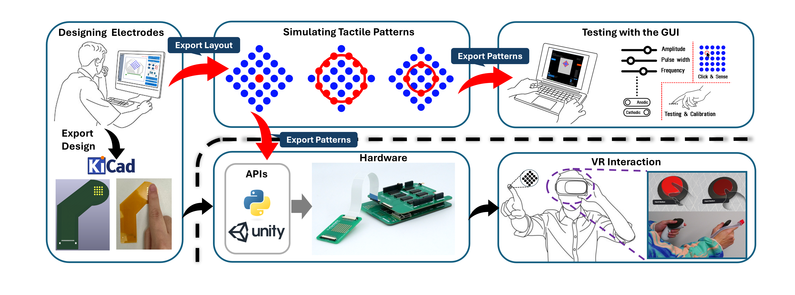
  <p align="center"><i><b>Using eTactileKit to design electrode, simulate and visualize patterns. testing and calibrating stimuli and using the APIs to develop a VR application</b></i></p>
</p>

This documentation will guide you through the necessary steps and guidelines to follow to get started with eTactileKit.

---

## 2. Features

- Modular and extensible **hardware design** that can support customised electrode layouts.
- Easy-to-use **Software GUI** for electrode design for various 2D and 3D scenarios.
- **Pattern Creator** to create and visualise tactile patterns.
- **Real-time hardware access and control GUI** for debugging and testing outputs.
- **Comprehensive documentation** for quick onboarding and how-to-dos.
- **APIs** for Python and Unity for seamless integration with widely adopted platforms.

---

## 3. Getting Started

### Clone this GitHub repository or download and unzip the zip file.

### Need to try out a quick tactile pattern on your fingers? We got you covered!

Follow the steps below:

1. **Ensure that the Jumper `J3` as denoted [here](#4-hardware-design) is connected**

2. **Connect the board to the computer via a UCB-C to USB-A cable**

3. **Let's follow all the steps as described in [Section 8](#81-2d-mode-for-2d-patterns)**
  
    Here when selecting the array select `electrodes_array_mainboard.json` from the `array` folder and the pattern `example_main_board_0.json`, from the `pattern` and follow the steps ahead.

4. **You can have the same array and try out the following different patterns returning from step 01 above.**
  `example_main_board_1.json`
  `example_main_board_2.json`
  `example_main_board_3.json`
  `example_main_board_4.json`

---

## 4. Hardware Design

The hardware comprises of 2 main components:

1. The main controller
2. The switching controller

The main controller is responsible for the high voltage generation, and a current controller, a microcontroller that handles commands and processes commands. The switching controllers can be stacked on the main controller. You can stack multiple switching controllers on top of each other for a higher number of electrode applications.

The main controller board itself can be used standalone with its onboard electrodes. This can be used for initial testing and validation of hardware.

<p align="center">
  
  <p align="center"><i><b>PCB design of the main controller and the switching board and their stacked view</b></i></p>
</p>

**Important: Make sure that the jumper `J3` annotated above is in place when using the board standalone. If stacked this should be unplugged and `DIN` should be plugged.**

For stacking the boards, you can align the Male and Female headers on the two boards as shown below. The Headers are kept separately to easily identify the alignment. **!!Do not push the boards to hard since it might make it harder to remove!!**

<p align="center">
  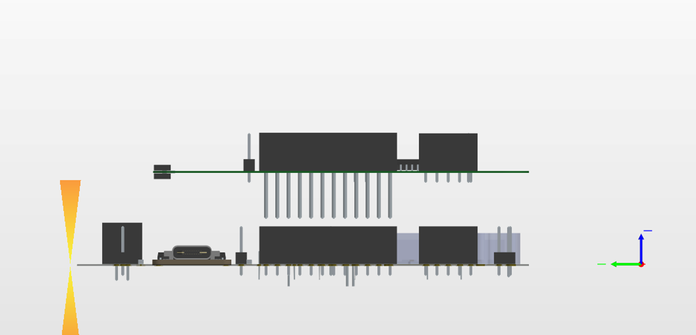
  <p align="center"><i><b>PCB design of the main controller and the switching board and their stacked view</b></i></p>
</p>

For applications requiring more than 64 electrodes, multiple switching circuits can be stacked on top of each other. **!!Please follow the guidelines below!!**

1. Plug the jumper `DIN` as before on the first stack
2. Do not plug the jumper for stacks starting from the second stack
3. Connect the `DOUT` from the first stack to the `DIN` of the second stack using a female-to-female jumper wire.
4. Continue step 03 above for the other stacks.

**!!You should not plug the jumper starting from stack 2!!**

The hardware architecture of how the hardware functions is shown below. A more detailed explanation can be found in our paper.

<p align="center">
  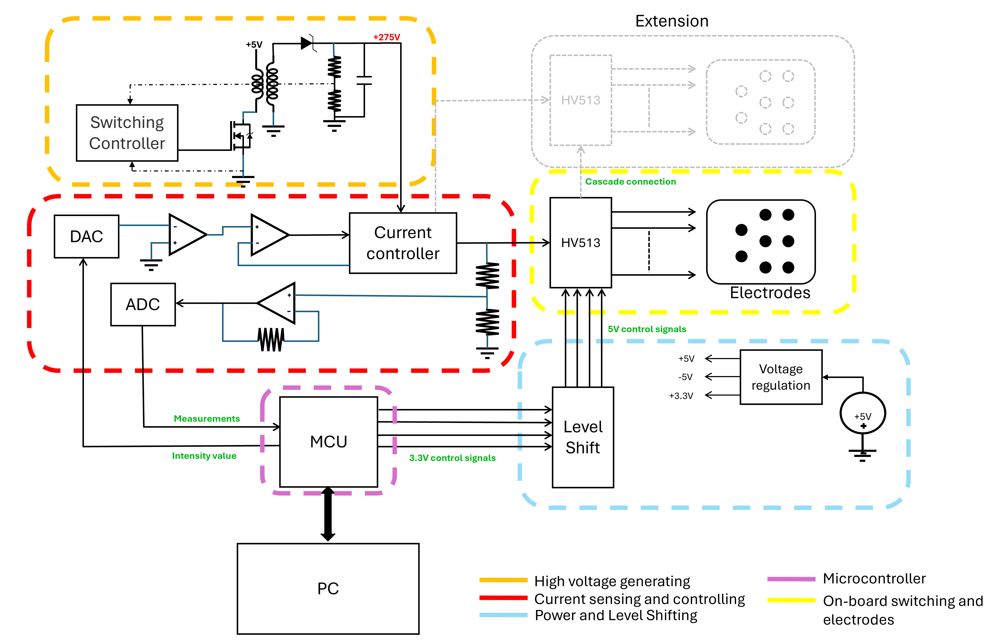
  <p align="center"><i><b>Hardware architecture</b></i></p>
</p>

**Note: Current limiting**
The `J2` jumper is used to limit the current. So, if you need the maximum current output, you can short circuit the `J2` jumper. 
**If you need to limit the current, you can connect a current limiting diode to the `J2` jumper (`J2` is a female jumper.)**

### 4.1 Ordering eTactileKit PCBs

All the manufacturing files to order PCBs are set at the location below.

```bash
1_Hardware/03_Fabrication_Files
```

You can follow the resources mentioned in [Section 6.2](#62-creating-pcb-electrode-layouts) to send these files for manufacturing to get your own PCB designed. Both the `Controller Board` and the `Switching Board` are available. The `Bill of Material` sheet contains all the part details and the required components. You can use this to place the component orders.

### 4.2 Creating your own PCBs

The PCB design was done using [Altium](https://www.altium.com/). The complete PCB project can be found in the location below.

```bash
1_Hardware/02_PCB_Designs
```

You can edit this project or incorporate the above into your projects for further improvisation. You can find the Schematics and other resources at the location below.

```bash
1_Hardware/04_Resources
```

---

## 5. Firmware

eTactileKit hardware is controlled by a microcontroller [Seed Studio esp32s3](https://wiki.seeedstudio.com/xiao_esp32s3_getting_started/). It is responsible for sending commands to control hardware and handling communication between the PC and hardware.

Firmware can be uploaded using [Arduino IDE](https://www.arduino.cc/en/software) by adding the necessary ESP32 boards package as described [here](https://wiki.seeedstudio.com/xiao_esp32s3_getting_started/). Note that if you are using arduino the main.cpp file should be renamed as a `.ino`.

You can find the firmware at the following location and follow the steps to install it on the microcontroller.

```bash
2_Firmware\EtactileKit
```

The firmware supports similar hardware, and since our toolkit hardware is similar to Kajimoto Sensei's hardware, you can use the same firmware **by making sure you do the following change**

<p align="center">
  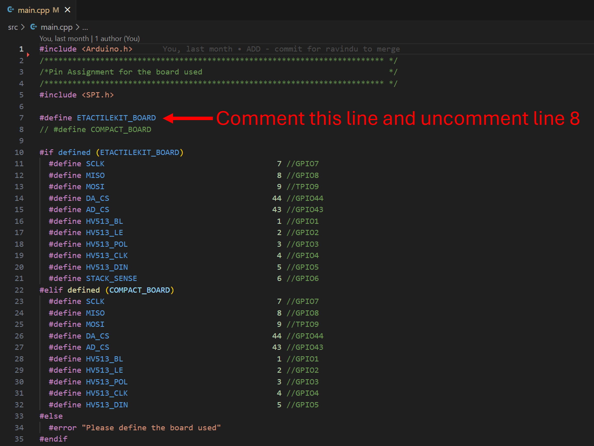
  <p align="center"><i><b>Hardware architecture</b></i></p>
</p>

### 5.1 Overview of Pulse Parameters

It's important to understand the stimulation pulse parameters before we start to understand the firmware. Here is a list of abbreviations used to represent the parameters of the system.

| Parameter | Description                                   |
| --------- | --------------------------------------------  |
| `PW`      | Pulse width of the stimulation pulse          |
| `PH`      | Pulse height of the stimulation pulse         |
| `DT`      | Channel Discharge time                        |
| `SF`      | Stimulation Frequency                         |
| `SPW`     | Pulse width of the impedance measure pulse    |
| `SPH`     | Pulse height of the impedance measure pulse   |
| `LST`     | Loop stabilization time                       |
  
<p align="center">
  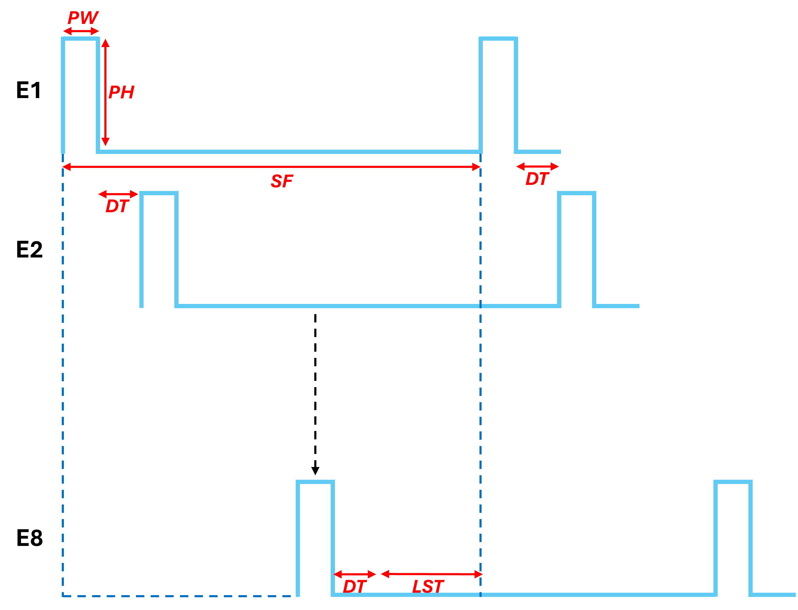
  <p align="center"><i><b>Timing diagram of eTactilekit with 8 electrodes</b></i></p>
</p>

Each electrode is scanned by **time division multiplexing.** However, when an electrode is scanned, activation is decided based on the stimulation pattern command sent from the **host device (PC).** Each time an electrode is activated, all the others will be deactivated. To make it more technical, when one electrode is sourcing current, all the others are sinking current (This is particularly called **Anodic stimulation**). On the other hand, in **Cathodic Stimulation**, when one electrode is sinking current, all the other electrodes will be sourcing current.

The **pulse height (PH)** and **pulse width (PW)** parameters are responsible for the amount of intensity. Once an electrode is activated a delay of time **DT (discharge time).** In other words, this is the **inter-channel idle period.** After all the electrodes(8 in the above case) have been scanned the time to satisfy the **stimulation frequency (SF)** will be delayed, called the **loop stabilization time (LST).**

Furthermore, the hardware can sense the amount of current drawn through each electrode, which allows eTactileKit to do sensing. This can be understood better in the hardware section. In order to sense, a **lower amplitude (SPH)** and a certain **pulse width (SPW)**(unnoticeable pulse) can be set to measure the amount of actual current drawn, and thereby calculate the impedance across the electrodes.

### 5.2 Stimulation Configurations and Experiences

In general, the sensation rendered by electro-tactile is cutaneous vibrations. However, electro-tactile has been shown to render novel tactile experiences including [thermal presentation](https://ieeexplore.ieee.org/abstract/document/9517195), [compliance](https://dl.acm.org/doi/10.1145/3613904.3641907) and many more interesting sensations. These sensations are achieved by triggering various types of mechanoreceptors within our skin using various methods. Thus, having a basic understanding of how pulse parameters and configurations affect the sensation is important.

etactileKit provides the ability to do Anodic and Cathodic stimulation. Anodic is where a single electrode is sourcing current, and all the other electrodes act as cathodes, and Cathodic is vice versa. The interesting fact is they render different sensations. Anodic, the most widely used rendered vibration sensations, while Cathodic tends to present a pressure/sticky sensation.

In reference to the pulse parameters mentioned in [section 5.1](#51-overview-of-pulse-parameters):
`PH` - is the amount of current delivered, obviously controlling the strength of the stimulation.
`PW` - Lower pulse width enables deeper travel and activation of various mechanoreceptors. Lowering the pulse width gives more of a cutaneous/pain sensation and increasing it reduces this but increases the intensity felt.
`SF` - A higher frequency tends to give a smoother sensation. However, larger frequencies are not perceivable by the skin and might not render effective tactile information. However, lowering the frequency will enable feeling individual pulse activation, giving a sensation of exploding bubbles, if tried on the fingertips.

However, the aforementioned does not limit the possibilities of electro-tactile sensations, and the toolkit provides full access to tuning these pulse parameters using its GUI for the users to explore novel experiences.

---

## 6. Electrode Design Tool

The electrode design tool is a GUI-based tool to assist in creating custom electrode layouts.
The tool supports creating:

1. Electrode layouts that can be exported in **PDF format** to support inkjet printing and laser cutting
2. Electrode layouts for **PCB fabrication**
3. Electrode layouts for **3D surfaces**

<p align="center">
  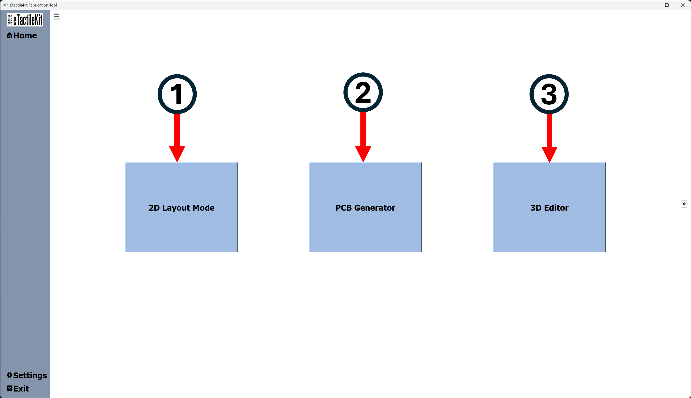
  <p align="center"><i><b>Entry layout to the electrode design</b></i></p>
</p>

The tool is developed using [Python](https://www.python.org/downloads/). Installing the required libraries is important to the functionality of the tool. 

If you are using an older version of Visual Studio, make sure to have Visual Studio 2022 C++ build tools installed. You can install them by running the following command in your CMD or shell. If you already have the C++ build tools installed, you can proceed to the next steps.

```bash
winget install Microsoft.VisualStudio.2022.BuildTools --force --override "--wait --passive --add Microsoft.VisualStudio.Component.VC.Tools.x86.x64 --add Microsoft.VisualStudio.Component.Windows11SDK.22621"
```

Follow the steps below to initiate the tool:

1. **Locate the project folder at the below location and open the Command Line Interface(CLI) and navigate to the below location**

    ```bash
    3_Electrode_Design_Tool
    ```

2. **Create a virtual environment in your project directory(Recommended)**

    ```bash
    >> pip install virtualenv
    ```

    Now let's create a virtual environment named `electoolenv`. You can use your preferred name.

    ```bash
    >> virtualenv electoolenv
    ```

    Navigate to the Scripts folder

    ```bash
    >> cd electoolenv/Scripts
    ```

    Activate the environment.

    ```bash
    >> activate
    ```

    Now navigate to the `3_Electrode_Design_Tool` folder using `cd ..` twice.

3. **Use the requirements file to install the required libraries**

    ```bash
    >> pip install -r requirements.txt
    ```
  
4. **Open VScode project in the `3_FabricationTool_App` Folder**

    Locate the main.py file in the following location and run it

    ```bash
    3_FabricationTool_App\src\main.py
    ```

Now you are ready to go. Happy electrode designing!

### 6.1 Creating 2D Electrode Layouts for PDF Exports

Below is the view of a simple and finalised 3*3 electrode layout ready to be exported. The annotations will help you guide through the steps described below to design your own customised electrode layouts that can be exported as PDF files.

<p align="center">
  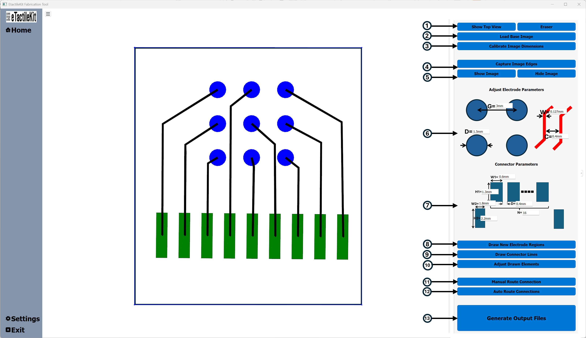
  <p align="center"><i><b>Annotated 2D electrode design layout view</b></i></p>
</p>

1. **Step 1: Importing the desired layout image to the canvas(2)**

    For best results, we recommend the users import the layout images with sharp edges as in the following example scenario. This particular design was done on PowerPoint and exported as an image. You can add the created image to the `image` folder in you project directory.

    <p align="center">
      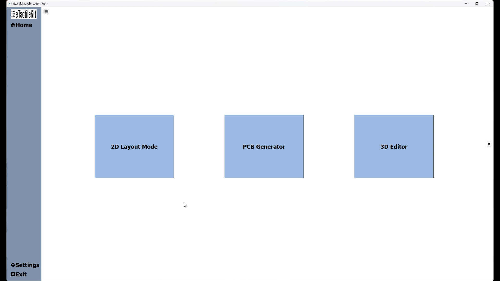
      <p align="center"><i><b>Importing an image with the target shape to the canvas</b></i></p>
    </p>

2. **Step 2: Calibrating the dimensions to the real world dimensions(3)**

    The image, when imported, is not in its real world dimensions but scaled out uniformly. Here, the user can set **one preferred dimension** to adjust the layout to the real-world dimensions.

    <p align="center">
      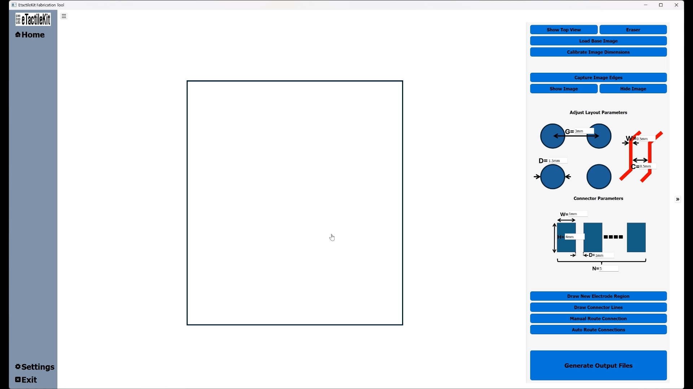
      <p align="center"><i><b>Calibrating the dimensions of the image</b></i></p>
    </p>

3. **Step 3: Capture the edges of the calibrated image(4, 5)**

    Now you can capture the edges. You can also hide or show the preview of the original image according to your preference.

    <p align="center">
      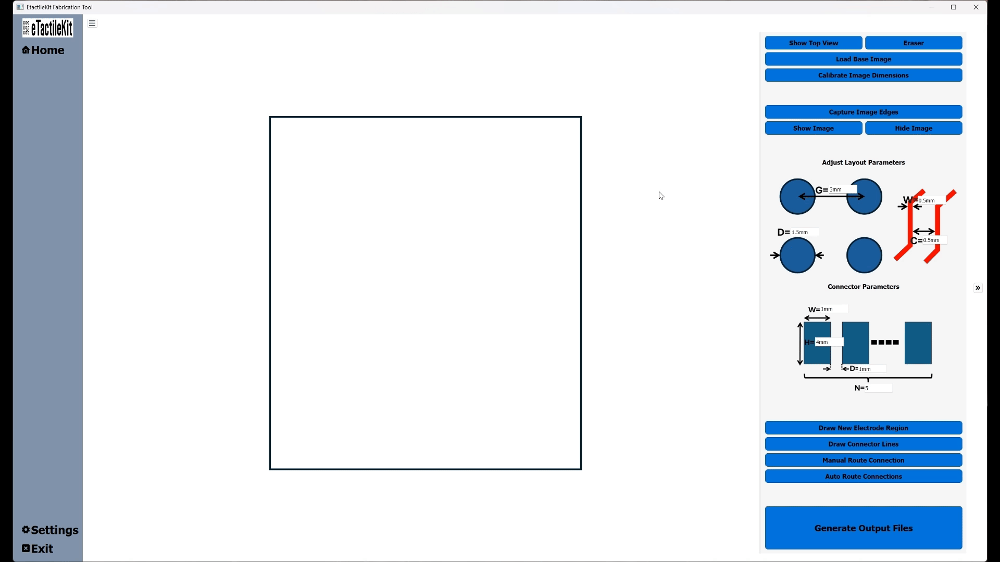
      <p align="center"><i><b>Capturing the edges and hiding/showing the original image preview</b></i></p>
    </p>

4. **Step 4: Adjust the electrode, connector and routing parameters(6, 7)**

    Next, we set the layout and routing parameters before we populate electrodes, place connectors and do the routing. Here you can specify the parameters according to the layout that your final outputs needs to appear. If you are not quite sure at this step, you can adjust these parameters later on as well.

    <p align="center">
      
      <p align="center"><i><b>Adjusting electrode, connector and routing parameters</b></i></p>
    </p>

5. **Step 5: Populating electrodes(8, 1)**

    Here we use the tools' free-form region selection to populate electrodes. You can use the eraser to delete any unwanted electrodes, connectors or traces. You can reset the view with the buttons shown on layer 1.
    **Important: make sure to click on the eraser again to turn off the eraser mode**

    <p align="center">
      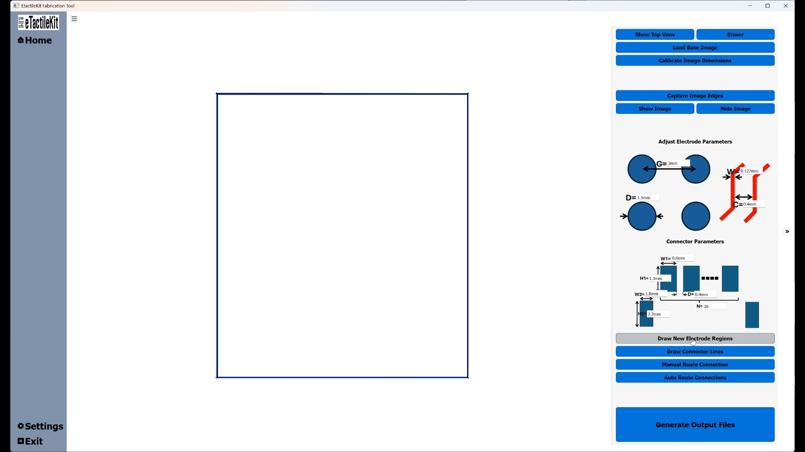
      <p align="center"><i><b>Drawing regions to populate electrodes</b></i></p>
    </p>

6. **Step 6: Adding Connectors(9)**

    Here we use lines to place connectors. Connectors will be created based on the location and the orientation of the lines created.
    **Note: You can use the eraser to clear any unwanted connectors.**

    <p align="center">
      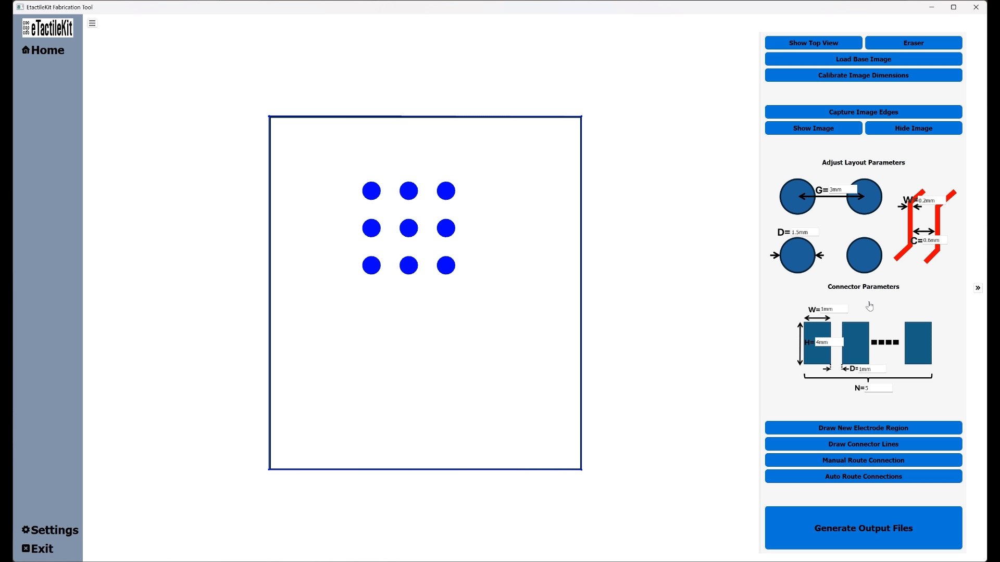
      <p align="center"><i><b>Adding connectors</b></i></p>
    </p>

7. **Step 7: Adjusting Electrode Orientations and Positions(10)**
    Here, we adjust the electrodes to our desired locations as needed. You can move and rotate a selected set of electrodes as shown below. You can select the required electrodes by using the `Select Elements to Move` button. You can specify rotation angles, the movement step size and most importantly, you can reset back to the original location if needed.

    <p align="center">
      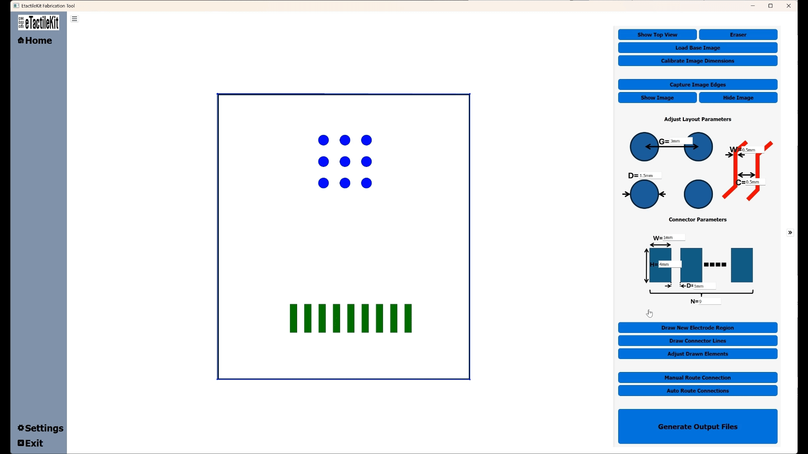
      <p align="center"><i><b>Changing location and orientation of electrodes</b></i></p>
    </p>

8. **Step 7: Routing connections between electrodes and connectors(11,12).**

    In this step, you can route connections between electrodes and connectors. Here, you can use both manual and automatic routing options.
    **Note 1: The automatic routing might not be able to route all the connections. So you might need to route manual connections as well.**
    **Note 2: You can use the eraser to clear unwanted traces.**

    <p align="center">
      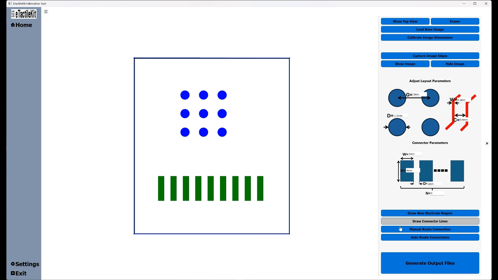
      <p align="center"><i><b>Routing using automatic and manual routing modes</b></i></p>
    </p>

9. **Step 8: Generating output files(13)**

    In the last step, you generate the output files. Here, the tool will generate a PDF layout of the electrodes and connectors, a mask for the electrodes and a JSON file that can be used in the pattern creator tool in further steps of the design tool.

    <p align="center">
      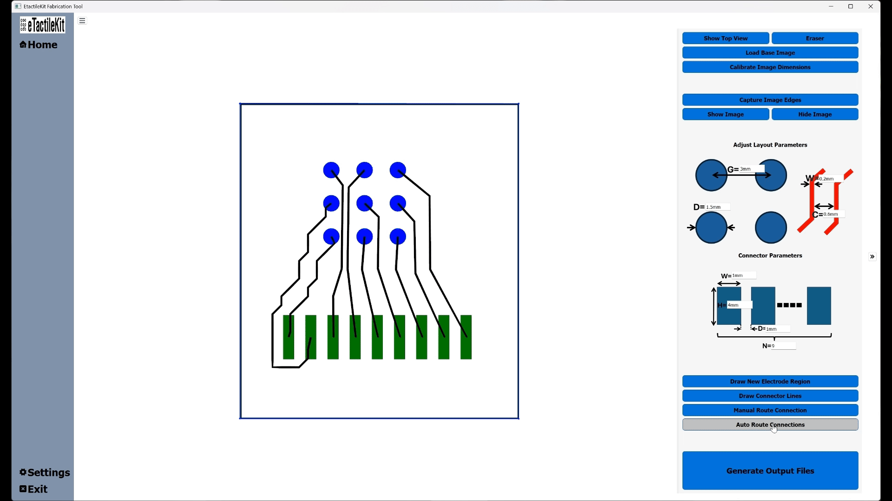
      <p align="center"><i><b>Generating the output files</b></i></p>
    </p>

    The respective export files will be as shown in the figure below.

    <p align="center">
      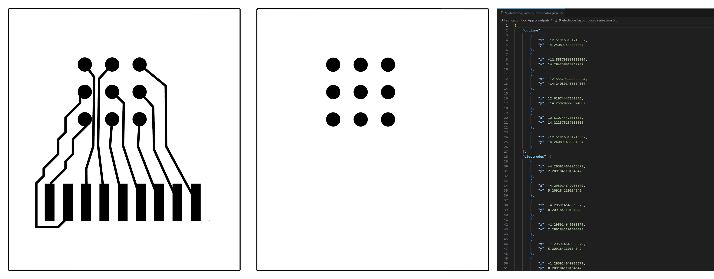
      <p align="center"><i><b>The exported PDF layout, mask and a part of the JSON export</b></i></p>
    </p>

10. **Step 9: Adjusting the electrode mapping function**

    In your output files, there will be a JSON file named,
     `[YOUR SAVE FILENAME]_contour_and_electrodes.json`. In that JSON file, there is a section called `"Mapping_func":`.

    <p align="center">
      
      <p align="center"><i><b>Mapping function</b></i></p>
    </p>

    Here, you can see an array from `0` to `number_of_electrodes - 1` (ex: 0 - 7 if you have 8 electrodes).

    This mapping function says the electrode mapping between the connector and the array. So, here it is `0th` connector to `0th` electrode, `1st` connector to `1st` electrode, likewise.
    **You should change these mappings according to your array settings.**

### 6.2 Creating PCB Electrode Layouts

We use a KiCad plugin that can read the JSON file and automatically layout the PCB in [KiCad](https://www.kicad.org/). The current version of KiCad used is [KiCad 8.0.2](https://downloads.kicad.org/kicad/windows/explore/stable)

You need to set up the Python plugin for KiCad in order to proceed with the further steps. Locate the Python plugin at the below location.

```bash
4_Electrode_Design_Tool\1_KiCad_Plugin\et_plugin.py
```

Next if you are a **Windows** user, you can copy this file to the following directory (**This is path under default installation of KiCAD**).

```bash
C:\Users\user\Documents\KiCad\8.0\scripting\plugins
```

If you are a **MAC** user the default path would be:

```bash
/Applications/kicad/Kicad/Contents/SharedSupport/scripting/plugins
```

**Great!. Now you are all set to use the pcb design tool of eTactileKit.**

The initial phase of the PCB layout generation includes the same steps that were followed in the previous mode in [Section 6.1](#61-creating-2d-electrode-layouts-for-pdf-exports) above. The exported files will have two JSON files one having information for PCB desing and the other for the pattern creator tool with layout coordinates. The default [footprint](https://au.mouser.com/ProductDetail/Hirose-Connector/FH12-16S-1SH55?qs=Ux3WWAnHpjBc3pYMMfcXYg%3D%3D) matches the family and the pitch of the same connector used in eTactileKits hardware.

**Important: make sure you choose the number of connector pads according to your footprint**
Now let's go through the steps to generate PCB Files using KiCAD.

1. **Step 1: Importing the generated JSON file via the KiCAD plugin**

    Now let's import the JSON file generated from the tool via the plugin to layout the PCB.
    <p align="center">
      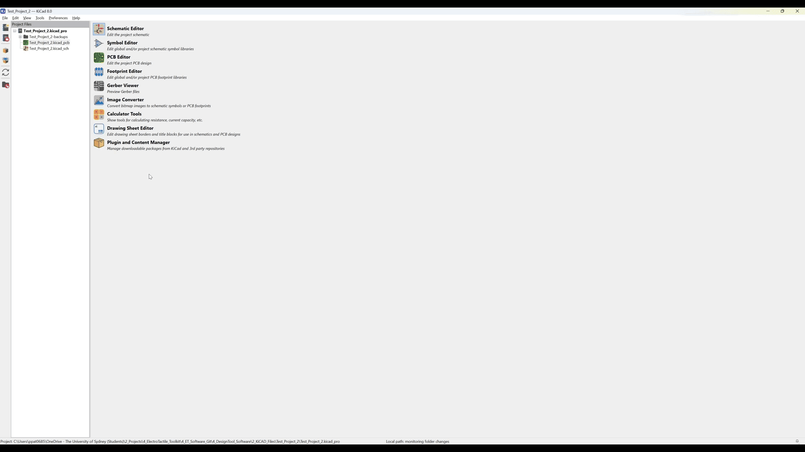
      <p align="center"><i><b>Importing JSON file via kiCAD plugin to generate PCB</b></i></p>
    </p>

2. **Step 2: Exporting manufacture-ready fabrication outputs to order PCBs**

    In this step, we export fabrication files that are ready to be sent for manufacturing PCBs. You can [refer to the tutorial video](https://www.youtube.com/watch?v=pGRm7nT1zaw) that guides you through the export procedure and ordering from [JLC PCB.](https://jlcpcb.com/)

### 6.3 Creating Electrodes on 3D Surfaces

The 3D electrode design tool is capable of importing a given mesh object (STL or OBJ) and then populating connectors and electrodes and do automatic routing. The mesh and the routing objects can be seperately exported as OBJ files that can be 3D printed. Conductive materials can be used to print the routes.
<p align="center">
  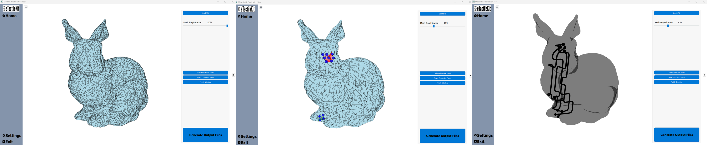
  <p align="center"><i><b>Overview of a bunny populated with electrodes and the routed view from the tool</b></i></p>
</p>

You can follow the steps below to create your own custom 3D electrodes.

1. **Step 1: Importing a mesh file to the canvas**

    You can import a mesh file in STL or OBJ format to the canvas to start proceeding.
    **Note: You can use the mouse wheel to zoom in and zoom out, the left button to rotate, and press the mouse wheel to pan the canvas**
    <p align="center">
      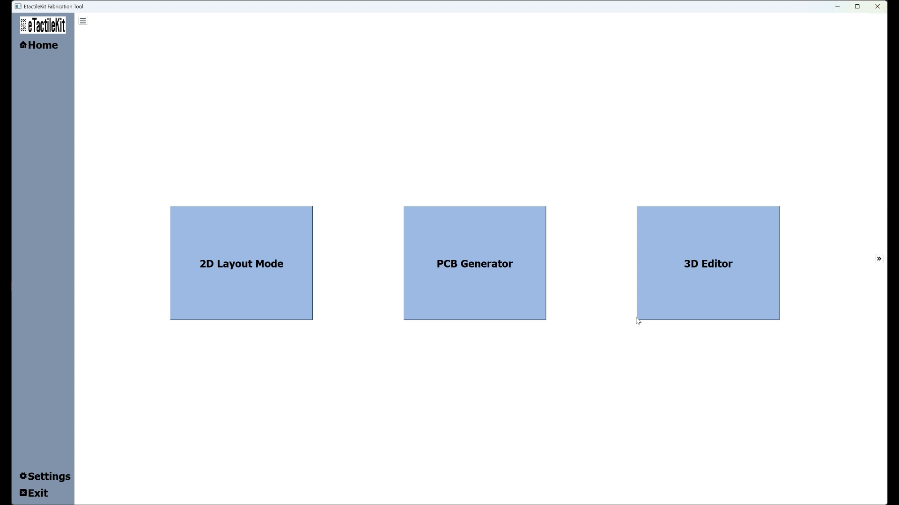
      <p align="center"><i><b>Importing a STL mesh into the tool canvas</b></i></p>
    </p>

2. **Step 2: Reducing the mesh to ease further operations**

    Here we will scale down the mesh to make it easier for us in the further steps. This will save time and reduce complexity in mesh operations.
    <p align="center">
      
      <p align="center"><i><b>Reducing the mesh and adjusting the view</b></i></p>
    </p>

3. **Step 3: Populating electrodes and connectors**

    Now we can set the electrode, connectors and routing parameters before we place and start routing electrodes and connectors. Then we can select the faces to populate electrodes and connectors seperately.
    **Important: Use SHIFT+LEFT mouse button to select individual faces**

    <p align="center">
      
      <p align="center"><i><b>Adjusting parameters and populating electrodes and connectors</b></i></p>
    </p>

4. **Step 4: Generate routing traces connecting the connectors and electrodes**

    Next we can generate the routing traces to create connections between electrodes and connectors

    <p align="center">
      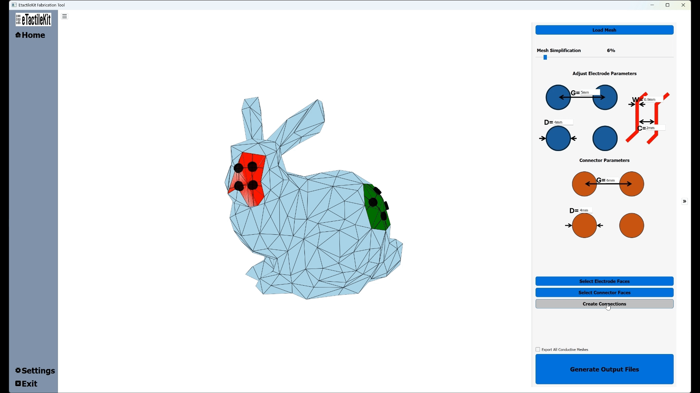
      <p align="center"><i><b>Automatically generating routing paths</b></i></p>
    </p>

5. **Step 5: Generating output files**

    Finally, we generate the output mesh files that include the routing traces and the mesh object. The output file format is OBJ ,and it is to maintain compatibility with other components of the toolkit.

    <p align="center">
      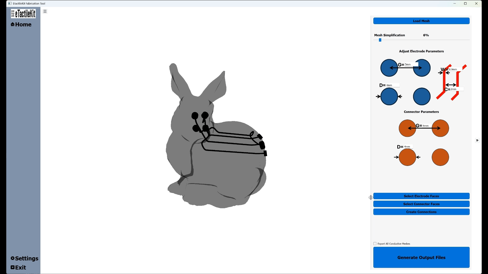
      <p align="center"><i><b>Exporting files</b></i></p>
    </p>

6. **Step 6: Adjusting the electrode mapping function**

    In your output files, there will be a JSON file named,
     `[YOUR SAVE FILENAME]_contour_and_electrodes.json`. In that JSON file, there is a section called `"Mapping_func":`

    <p align="center">
      
      <p align="center"><i><b>Mapping function</b></i></p>
    </p>

    Here, you can see an array from `0` to `number_of_electrodes - 1` (ex: 0 - 7 if you have 8 electrodes).
    This mapping function says the electrode mapping between connctor to the array. So, here it is `0th` connector to `0th` electrode, `1st` connector to `1st` electrode like wise.
    **You should change these mappings according to your array settings.**

**Happy 3D printing!**

You can use preferred methods for managing the connections to the connectors. One of the methods is using a soldering iron to melt the exposed connector region to bind wires as shown below.
<p align="center">
  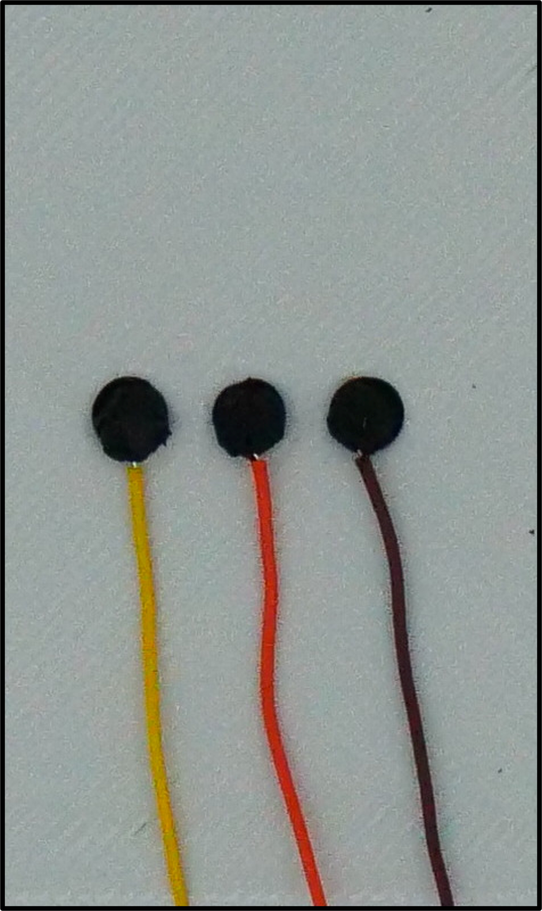
  <p align="center"><i><b>Wires fused to connectors by melting using a soldering iron</b></i></p>
</p>

---

## 7. Tactile Pattern Creator

### Prerequisites  

Before proceeding, ensure you have **Processing 4** installed on your system. You can download it from the official website: [Processing Download](https://processing.org/download)

Once Processing is installed, you need to add the required libraries. Follow these steps for installation:  

1. Open Processing.  
2. Navigate to **Sketch** → **Import Library...** → **Manage Libraries...**  
3. In the **Libraries** tab (default), search for **PeasyCam** and then install it.
4. In the **Libraries** tab (default), search for **ControlP5** and then install it.
5. If you are a **MAC** User go to **Tools** → **Install Processign-java**.

For a step-by-step guide, refer to the following video:  

<p align="center">
  
  <p align="center"><i><b>Install the PeasyCam library</b></i></p>
</p>


### 7.1 Setup the pattern creator

The **Tactile Pattern Creator** is a scripting-based tool designed to generate tactile patterns for 2D or 3D electrode arrays. It offers both built-in patterns and the flexibility to create custom patterns, enabling users to tailor designs to their specific requirements. 

#### Step 1: Navigate to the `4_Pattern_Creator` folder

In this folder there are two folders as `Processing_program` and `Library`. 

- `Processing_program\`: This folder contains all the source code of the processing program. If you need to do any improvement, you can use this program.
- `Library\`: This folder contains the `eTactile` processing library which you need to install to your processing and play!

#### Step 2: Install the `eTactile` library

Install this library to your processing is not hard at all. What you have to do is,

1. Download the `eTactile` folder (the folder inside the `4_Pattern_Creator`).
2. Locate the Processing's libraries folder in your PC.

   - **Windows:** `Documents\Processing\libraries\`
   - **Mac:** `Documents/Processing/libraries/`

3. Place the `eTactile` folder inside the `libraries` folder.
4. Restart processing.

#### Features in `eTactile` library

- **Built-in Patterns**: Access a library of pre-defined patterns for quick implementation.
- **Custom Pattern Design**: Create unique patterns using a scripting interface for full control over electrode activation.
- **2D and 3D Support**: Compatible with both 2D and 3D electrode arrays.
- **Scripting Flexibility**: No GUI constraints, users can write scripts to automate and customize pattern generation.

Now you are **ready to go !!!**

### 7.2 Creating 2D Electrode patterns using library

#### Step 1: 2D pattern template

We have given a template for 2D pattern creation in our llibrary. To access that template,

  1. Open a processing sketch.
  2. Navigate File → Examples...  ; this will pop-up the **Java Examples** window.
  3. In **Java Examples** window, expand the **Contributed Libraries** folder.
  4. In that folder you can see our **eTactile** library.
  5. Expand the **eTactile** library. It will show another two folders as **2D** and **3D**.
  6. Now, expand the **2D** folder. In that folder you will see a file as **template2D**.
  7. Double click on that. It will open the 2D pattern template.

You can copy this template to your processing sketch or run it directly.

<p align="center">
  
  <p align="center"><i><b>Locate and open the 2D pattern template</b></i></p>
</p>

#### Step 2: Visualize the 2D Electrode Board

**Note:** If you run the **`template2D`** sketch that is directly from the examples, you will see the electrode array that is in the Main board of our toolkit (See the following video).
We have save these necessery JSON files in the `Data` folder that is inside each example.

<p align="center">
  
  <p align="center"><i><b>Directly run the template2D example </b></i></p>
</p>

**Note:** If you run the this template directly just copy and paste, it will show the electrode board that you have given as `electrode_board_file` (See the following video).
For this video, I use `electrodes_64.json` file. Since I have place it inside the sketch folder, I directly put the file name. But if you want, you can give **any specific location** as the file name.

<p align="center">
  
  <p align="center"><i><b>Copy the template and run it in my own sketch with different electrode board </b></i></p>
</p>

**Note:** 
  
- You can give any location to your **`output_file`**. If you just give  a name (ex: `output.json`) the output file will save on your sketch folder itself. 

- In built-in examples, the output file will save inside `Data/created_patterns` folder.
The library `examples` folder located in `"Documents\Processing\libraries\eTactile\examples"`


#### Step 3: Create a 2D Pattern using pattern library

Our 2D pattern library consists of a number of examples that you can load and try out. In our examples, we initially load the main board electrode array, but you can replace it with your own electrode array by providing the path to it, and save the output to any convenient location.

You can easily understand and edit the pattern parameters to adjust the pattern to your preference. 

<p align="center">
  
  <p align="center"><i><b>2D pattern examples </b></i></p>
</p>

**Note:** We highly encourage you to copy the pattern sketch from the example into your own sketch before making any changes. Otherwise, the original examples may be altered.

<p align="center">
  
  <p align="center"><i><b>Use of diverging ring pattern example </b></i></p>
</p>

### 7.3 Creating Customized 2D Electrode Patterns

As previously mentioned, our library provides users with the flexibility to design unique electrode activation patterns using a dedicated scripting interface. This allows for precise control over electrode stimulation, enabling customized tactile experiences.

To assist users in this process, we provide a standard template as a reference. If you wish to create a custom pattern, simply follow these guidelines:

#### Step 1: Copy the `template2D` from the examples

For the ease of user, we have already provided a template for pattern creation. So, you can easily copy it from our library examples as follows.

<p align="center">
  
  <p align="center"><i><b>Copy the template2D from the examples.</b></i></p>
</p>

And also, have a basic sketch on the pattern that you are going to create here. It will help you when you scripting.
For an example, here we have a face of a bunny and there are electrodes in the bunny's ears. We are going to activate those electrodes in the ears as diverging rings as you can see in following figure.

<p align="center">
  
  <p align="center"><i><b>Custom pattern we are going to create.</b></i></p>
</p>

#### Step 2: Load the electrode board and define the output

In this example, I created 2 subfolders inside my sketch folder as `JSON_Files` and `Created_patterns`. My electrode board JSON file is in `JSON_Files` folder and I'm going to save my output in `Created_patterns` folder.

<p align="center">
  
  <p align="center"><i><b>File structure (not necessery)</b></i></p>
</p>

Therefoe I define the `electrode_board_file` and `output_file` as;

```java
String electrode_board_file = "JSON_Files/bunny_face.json";
String output_file          = "Created_patterns/new_pattern";
```

After giving the `electrode_board_file` path, just run the sketch and get an idea about the electrode distribution. 
Here, the two diverging rings should start from the middle electrode of each ear. So, I need those two coordinates.

<p align="center">
  
  <p align="center"><i><b>Display the electrode board</b></i></p>
</p>

<p align="center">
  
  <p align="center"><i><b>Display the electrode board</b></i></p>
</p>

So, I can see here, the position of the center electrodes are:
`electrode 2: (382.6, 129.7)`
`electrode 8: (627.3, 122.2)`

#### Step 3: Define 2D pattern variables

In your sketch, after giving file names and location, you can define your function variables. To this pattern, I need two rings, that means two centers. And also, I initiate the radius to zero. 
The stroke of the ring is very important since it is the object that is overlap with electrodes. So, I initiate the stroke width as 8. And the delay between two frames as 100ms.

```java
// Definr your pattern variables here
float centerX1 = 382.6;
float centerY1 = 129.7;

float centerX2 = 627.3;
float centerY2 = 122.2;

int radius = 0;
int stroke_width = 8;
int frame_delay = 100;
```

**Note:** In **`void setup()`** you have nothing to do!


#### Step 4: Define the 2D pattern

Now you can define your pattern under **`void draw()`**.
We have given full flexibility to the user to define any kind of graphic here (by using general processing commands). 
But when you are going to define the pattern properties (like stimulation frequency, stimulation mode) you should use `eTactile` functions.

So I'm defining my pattern as follows.

**Note:** Don't set a background colour. `eTactile` library automatically set it to black for you.

```java
void draw() {
  stroke(0, 255, 0);
  strokeWeight(stroke_width);
  noFill();
  
  ellipse(centerX1, centerY1, radius * 2, radius * 2);
  ellipse(centerX2, centerY2, radius * 2, radius * 2);
  radius += 2;
  
  eTactile.eTfreq(75);
  eTactile.eTmode("Anodic");
  
  eTactile.eTframedelay(frame_delay);
  
  if (radius >= 50){
    radius = 0;
    eTactile.terminate();
  }
}
```

**Explanation:** Here I have drawn two rings and set the radius to increase by 2 in each iteration.

- **`eTactile.eTfreq(75):`** Set the stimulation frequency to 75Hz.
- **`eTactile.eTmode("Anodic"):`** Set stimulation mode to Anodic.
- **`eTactile.eTframedelay(frame_delay):`** Set the time delay between two frames.
- **`eTactile.terminate():`** This will save the pattern to the JSON file.

**Note:** If you don't set the frequency and the stimulation mode, it will automatically set to the default values as frequency = 75Hz and stimulation mode as "Anodic".

At the end, I have setted the `radius = 0` for loop the pattern. You can dynamically change the stimulation frequency and the stimulation mode as well.

<p align="center">
  
  <p align="center"><i><b>The created custom pattern</b></i></p>
</p>


### 7.4 Creating 3D Electrode Patterns Using Library

#### Step 1: 3D pattern template

We have given a template for 3D pattern creation in our llibrary. To access that template,

  1. Open a processing sketch.
  2. Navigate File → Examples...  ; this will pop-up the **Java Examples** window.
  3. In **Java Examples** window, expand the **Contributed Libraries** folder.
  4. In that folder you can see our **eTactile** library.
  5. Expand the **eTactile** library. It will show another two folders as **2D** and **3D**.
  6. Now, expand the **3D** folder. In that folder you will see a file as **template3D**.
  7. Double click on that. It will open the 3D pattern template.

You can copy this template to your processing sketch or run it directly.

<p align="center">
  
  <p align="center"><i><b>Locate and open the 3D pattern template</b></i></p>
</p>

#### Step 2: Visualize the 3D Electrode Board

**Note:** If you run the **`template3D`** sketch that is directly from the examples, you will see the electrode array that is in the Main board of our toolkit (See the following video).
We have save these necessery JSON files in the `Data` folder that is inside each example.

<p align="center">
  
  <p align="center"><i><b>Directly run the template3D example </b></i></p>
</p>

**Note:** If you run the this template directly just copy and paste, it will show the electrodes that you have given as `electrode_locs` and the 3D objec that you have given as `object3D`. (See the following video).
For this video, I use `bunny_nose.json` file and `StanfordBunny.obj`. Since I have place it inside the sketch folder, I directly put the file name. But if you want, you can give **any specific location** as the file name.

**Note:** Your 3D object **must be** in `.obj` format.

<p align="center">
  
  <p align="center"><i><b>Copy the template and run it in my own sketch </b></i></p>
</p>

**Note:** 
  
- You can give any location to your **`output_file`**. If you just give  a name (ex: `output.json`) the output file will save on your sketch folder itself. 

- In built-in examples, the output file will save inside `Data/created_patterns` folder.
The library `examples` folder located in `"Documents\Processing\libraries\eTactile\examples"`

#### Step 3: Create a 3D Pattern using pattern library

Our 3D pattern library consists of a number of examples that you can load and try out. In our examples, we initially load the stanford bunny and the nose electrodes, but you can replace it with your own 3D object and electrodes by providing the path to it, and save the output to any convenient location.

You can easily understand and edit the pattern parameters to adjust the pattern to your preference. 

<p align="center">
  
  <p align="center"><i><b>3D pattern examples </b></i></p>
</p>

**Note:** We highly encourage you to copy the pattern sketch from the example into your own sketch before making any changes. Otherwise, the original examples may be altered.

<p align="center">
  
  <p align="center"><i><b>Use of moving plane pattern example </b></i></p>
</p>

### 7.5 Creating Customized 3D Electrode Patterns

As previously mentioned, our library provides users with the flexibility to design unique electrode activation patterns using a dedicated scripting interface. This allows for precise control over electrode stimulation, enabling customised tactile experiences.

To assist users in this process, we provide a standard template as a reference. If you wish to create a custom pattern, simply follow these guidelines:

#### Step 1: Copy the `template3D` from the examples

For the ease of the user, we have already provided a template for pattern creation. So, you can easily copy it from our library examples as follows.

<p align="center">
  
  <p align="center"><i><b>Copy the template3D from the examples.</b></i></p>
</p>


#### Step 2: Load the 3D object, electrodes and define the output

In this example, I created 3 subfolders inside my sketch folder as `JSON_Files`, `3D_Objects` and `Created_patterns`. My electrode location JSON file is in `JSON_Files` folder, 3D object is in `3D_Objects` folder and I'm going to save my output in `Created_patterns` folder.

<p align="center">
  
  <p align="center"><i><b>File structure (not necessery)</b></i></p>
</p>

Therefoe I define the `electrode_locs`, `object3D` and `output_file` as;

```java
String electrodes_locs   = "JSON_Files/bunny_nose.json";
String object3D          = "3D_Objects/StanfordBunny.obj";

String output_name       = "Created_patterns/new_3D_pattern"; 
```

After giving the `electrode_locs` file and `object3D` paths, just run the sketch and get an idea about the electrode distribution. 

Here, we can't annotate electrode numbers as 0,1,2,3... in 3D space. Therefore, you should have a rough idea about the electrode distribution from the electrode design tool.

For convenience, let's see how we can create the moving plane (moving along the z-axis) in here.


#### Step 3: Define 3D pattern variables

In your sketch, after giving file names and location, you can define your function variables. 

First, let's define the starting point. Since this is 3D, it has three points as `startX`, `startY`, `startZ`. Since this is a plane, it has a `height`, `width` and `length`. 
When it moving, I'm going to move it from 1 unit for each frame (`increment = 1`). I take delay between two frames as 200ms (`delay_time = 200ms`).

```java
// Definr your pattern variables here
float startX = -72;    // X-coordinate of the plane's starting position
float startY = -60;    // Y-coordinate of the plane's starting position
float startZ = 20;     // Z-coordinate of the plane's starting position

int plane_width = 100;      // Width of the plane
int plane_length = 100;     // Length of the plane
int plane_height = 1;       // Thickness of the plane

int increment = 1;
int delay_time = 200;

float currentZ = startZ;
```

Here, I used a variable called `currentZ` to keep track of where we are now in the 3D space, since this is a plane that is moving along the z-axis.

**Note:** In **`void setup()`** you have nothing to do!


#### Step 4: Define the 3D pattern

Now you can define your pattern under **`void draw()`**.

Since this is a plane, I use `box()` function with very low height to generate the plane.

**Note:** Don't set a background colour. `eTactile` library automatically set it to black for you.

```java
void draw() {
  fill(0, 255, 0, 100); // Use semi-transparent green for the plane

  // Draw the moving plane
  pushMatrix();
  translate(startX + plane_width / 2, startY + plane_length / 2, currentZ + plane_height / 2);
  box(plane_width, plane_length, plane_height); // Draw the plane as a thin box
  popMatrix();
  
  eTactile.eTframedelay(delay_time);

  eTactile.eTfreq(75);
  eTactile.eTmode("Anodic");
  
  currentZ += increment;
  
  if (currentZ >= 55){
    eTactile.terminate();
    currentZ = startZ;
  } 
}
```

**Explanation:** Here I have drawn a plane and set the z coordinate of the frame to increase by 1 unit per frame. When it reaches to `z=55` a one pattern cycle is done and save it to the JSON file.

- **`eTactile.eTfreq(75):`** Set the stimulation frequency to 75Hz.
- **`eTactile.eTmode("Anodic"):`** Set stimulation mode to Anodic.
- **`eTactile.eTframedelay(frame_delay):`** Set the time delay between two frames.
- **`eTactile.terminate():`** This will save the pattern to the JSON file.

**Note:** If you don't set the frequency and the stimulation mode, it will automatically set to the default values as frequency = 75Hz and stimulation mode as "Anodic".

At the end, I have reset the `currentZ` for the loop of the pattern. You can dynamically change the stimulation frequency and the stimulation mode as well.

#### Step 5: Define the inclusion criteria

Unlike the 2D case, when it comes to a 3D canvas, we can't just read the pixel colour and say this electrode should be activated since the canvas pixels are 2D. Therefore, if you're trying to create a 3D pattern, you should define an inclusion criterion inside the following `boolean isInsideShape()` function.

```java
boolean isInsideShape(float x, float y, float z)
```

- Takes in the 3D coordinates `(x, y, z)` (the electrode coordinate) as the input
- Return `true` if the point is inside the volume of the 3D object.

Here, when it comes to moving a plane

```java
boolean isInsideShape(float x, float y, float z) {
  
  boolean withinX = x >= startX && x <= (startX + plane_width);
  boolean withinY = y >= startY && y <= (startY + plane_length);
  boolean withinZ = z >= currentZ && z <= (currentZ + plane_height);

  return withinX && withinY && withinZ;
}
```

Each of these checks whether the given point lies within the bounds of the moving plane along each axis:
**`withinX:`** Is the **`x`** coordinate inside the width of the plane?
**`withinY:`** Is the **`y`** coordinate inside the length of the plane?
**`withinZ:`** Is the **`z`** coordinate inside the current height/thickness of the plane?

Returns `true` **only if the point lies within all 3 boundaries** — i.e., the point is inside the 3D rectangular slice (the plane) at that frame.


<p align="center">
  
  <p align="center"><i><b>The created custom pattern</b></i></p>
</p>

---

## 8. Real-Time Hardware Access GUI

The eTactileKit provides a real-time hardware access GUI designed to enhance user experience and functionality. You can locate the Scripts to run the GUI below;

```bash
5_Interaction_Tool\eTactileKit_GUI
```

Built on the Processing platform, this GUI offers the following key features:

1. **Real-Time Visual Feedback**
  Monitor and visualize hardware activity in real time for better control and understanding.

2. **Calibration for Safety & Comfort**
  A dedicated calibration setup ensures optimal performance, prioritizing user safety and comfort before usage.

3. **Click & Sense Feature**
  Test and experiment with your electrode board effortlessly. Simply click on an electrode in the GUI to sense the electrotactile response.

  Each of these features is explained in detail below.

### Prerequisites for GUI

 The GUI needs the same set of libraries to be installed that were mentioned in [Section 7](#7-tactile-pattern-creator). If you haven't installed them already follow the guidelines to install the libraries before proceeding.

### Setting up the GUI

The Processing GUI project is located in `5_Interaction_Tool\eTactileKit_GUI\` folder.
Locate this folder and open the `eTactileKit_GUI.pde` file in processing and **run** it.

The interface should appear as shown in the following figure.
<p align="center">
  
  <p align="center"><i><b>eTactileKit GUI </b></i></p>
</p>

Here, you have 2 options as,

1. **2D MODE**
2. **3D MODE**

Select `2D MODE` if your electrodes are 2D (or if you created the pattern using `2D pattern creator`)
Select `2D MODE` if your electrodes are 3D (or if you created the pattern using `3D pattern creator`)

**IMPORTANT!** For `MAC` users if none of the 2D or 3D modes are opened, first make sure you installed processing java as instrcuted in [section 7](#7-tactile-pattern-creator) above. If the error still persists, you can find the path to the `processing-java` by running the following command.

```bash
which processing-java
```

by default this should return `/usr/local/bin`. If this is not the case **copy the path** and do the following change in the `launchSketch` function in your current script(`eTactileKit_GUI.pde`).

<p align="center">
  
  <p align="center"><i><b>Locating and adding the processign-java path</b></i></p>
</p>

### **8.1 2D MODE (for 2D patterns)**

After you click on the `2D MODE` button, the GUI for 2D pattern will appear. (**Note:** it will may take about 3 seconds)

<p align="center">
  
  <p align="center"><i><b>Open the 2D execution program</b></i></p>
</p>

**Explanation of elements in the GUI**

<p align="center">
  
  <p align="center"><i><b>2D execution program interface</b></i></p>
</p>

1. **SELECT COM PORT**
  Here, all avilable COM ports will appear and you have to select the COM port that is belongs to your **eTactileKit** hardware setup.

2. **REFRESH**
  By click on this button, you can update the list of connected COM PORTs.

3. **IMPORT ARRAY JSON**
  Here, you have to include the JSON file that incldes the information about your electrode array.

4. **CALIBRATION**
  By clicking on this button, you will directed to the **eTactile Calibration Setup**.

5. **INITIALIZE**
  By clicking on this button, you will directed to the execution program that gives real time visual feedback.

6. **CLICK & SENSE**
  By clicking on this button, you will directed to the **click and sense** program.

### Execute a 2D pattern using GUI

#### Step 1: Select COM Port and appropriate JSON files

1. Select the `COM port` that belongs to your hardware.
2. Select the JSON file that belongs to your electrode array. (**Make sure to navigate to the array directory**)


<p align="center">
  
  <p align="center"><i><b>2D execution program file selection</b></i></p>
</p>

After selecting above `COM port` and necessary JSON files, you can directly go to the `INITIALIZE` and execute the pattern.
But, you **don't have** a control of stimulation intensity level. **Therefore, we advice you to Calibrate before Initialize**.

**Step 2: Calibration**
After import necessery JSON files, click on the `CALIBRATION` button. This will open up the calibration interface.

<p align="center">
  
  <p align="center"><i><b>2D Tactile calibration setup</b></i></p>
</p>

In this callibration setup, initially the `Amplitude` has setted to 0, and the `Pulse width` has setted to 50. When you increase the amplitude, you can feel a blinking pattern from the electrodes and in the GUI, the electrode color strted to change according to the amplitude level (Green to Red).

1. Increase the amplitude using `up arrow` key until you feel a slight tactile sensation. Then click on `SET AS LOWER THRESHOLD` button. This will update your lower thershold values in the GUI.

2. After setted the lower thershold, increase the amplitude furtur until you feel uncomfortable tactile sensation. Use this point as your upper thershold by click on `SET AS UPPER THRESHOLD` button. This will update your upper thershold values in GUI.

**NOTE:** If you want, you can increase the `Pulse width` along with the amplitude as well. Anyway, both `Amplitude` and `Pulse width` values will be recorded when set the thersholds.

After calibration, you can initialize the execution program by clicking on `INITIALIZE` button.
Here, when you click on the `INITIALIZE` button, a pop up window will appear and show you a calibration summery.

<p align="center">
  
  <p align="center"><i><b>2D Tactile calibration setup</b></i></p>
</p>

<p align="center">
  
  <p align="center"><i><b>2D Tactile calibration setup</b></i></p>
</p>

After showing the calibration summery window if you feel like you didn't calibrate correctly, you can click on `GO BACK` button and do the calibration again.

If all looks good, you can click on `CONTINUE` button and go to execution stage.

**Step 3: Execute the 2D pattern**
After you come to the execution stage, you can see an interface like follows.

<p align="center">
  
  <p align="center"><i><b>2D Execution interface </b></i></p>
</p>

Here, in top left side, it shows your selected `COM port` and there is a button named `IMPORT PATTERN JSON`. 

**`IMPORT PATTERN JSON` button:**
  Here, you have to include the JSON file that contains details about your stimulation pattern.

And the top right side, it shows the stimulation `frequency` value and the `polarity`.

**NOTE: Visual eloboration of the following parameter descriptions can be seen in [Section 5.1](#51-overview-of-pulse-parameters).**

**Bottom left side:**

1. **`POLARITY` switch:** By using this switch, you can toggle the polarity to `anodic` or `cathodic`. Default it is `anodic`.
2. **`STIMULATION FREQUENCY` slider:** By using this slider, you can adjust the stimulation frequency. Default it has setted to 75Hz.
3. **`DISCHARGE TIME` slider:** Gap between two consecutive pulses in two electrodes.

4. **`Amplitude` and `Pulse Width`:** Here, it display the stimulation pulse Amplitude and the stimulation pulse width.

5. **`OVERRIDE` button:** Since pattern creator export all frequency and stimulation mode details, we don't need to give a fixed frequecncy or a fixed stimulation mode to the pattern. Therefore, initinally the `POLARITY` switch and `STIMULATION FREQUENCY` slider has deactivated. If you really need to control frequency and stimulation mode manually, you can click on `OVERRIDE` button and activate frequency slider and polarity switch and manually control those parameters.

**Bottom right side:**

1. **`PULSE HEIGHT` textbox:** Here, you can update the `sense pulse height`.
2. **`PULSE WIDTH` textbox:** Here, you can update the `sense pulse width`.
3. **`Sense Height` and `Sense Width`:** Here, it display the sense pulse Amplitude and the sense pulse width.

**Middle right side:**

Here, it displays the real time readings from sensing (touched electrodes).

**`START/STOP` button:** by clicking on this you can start or stop the program.

**`BACK TO HOME` button:** by clicking on this, you can go back to 2D pattern home page.

By clicking on `START` button, you can execute the program and the real time execution pattern will appear in the screen.

<p align="center">
  
  <p align="center"><i><b>2D pattern execution</b></i></p>
</p>


**Electrode feedback readings**

In the execution GUI, in the bottom right corner, there are two text boxes as `start`, `end` and a button called `DISP` as shown in below.

<p align="center">
  
  <p align="center"><i><b>Feedback readings inputs</b></i></p>
</p>

Here you have to input the range of electrodes that you want to observe the feedback readings and click on the `DISP` button. Then the readings will be display on the right corner of the GUI.

**Note: press `ENTER` after you insert values for each boxes, `START` and `END`.**

Then, it will display the readings and touched electrodes as shown in below.

**Note: Irrespective of the inputted range, this will display feedback for all touched electrodes if there is contact.**

<p align="center">
  
  <p align="center"><i><b>Feedback readings in GUI</b></i></p>
</p>

### **8.2 3D MODE (for 3D patterns)**

After you click on the `3D MODE` button, the GUI for 3D pattern will appear. (**Note:** it will may take about 5 seconds)

<p align="center">
  
  <p align="center"><i><b>Open the 3D execution program</b></i></p>
</p>

#### **Explanation of elements in the GUI**

<p align="center">
  
  <p align="center"><i><b>3D execution program interface</b></i></p>
</p>

Every button and the drop down menu in here is same as the 2D mode configuration mentioned in [Section 8.1](#81-2d-mode-for-2d-patterns) except the `IMPORT 3D OBJECT` button.

1. **IMPORT 3D OBJECT**
  By clicking on this button, you can select your 3D object file (this should be in .obj format).

### Execute a 3D pattern using GUI

#### Step 1: Select COM Port, 3D object and appropriate JSON files

1. Select the `COM port` that belongs to your hardware.
2. Select the object file (.obj) that belongs to your 3D object.
    **NOTE:** When you try to browse the first file, the browsing window maybe appear inder your GUI. Therefore, if you can't see a browsing window, plese check under the GUI as follows.

    <p align="center">
      
      <p align="center"><i><b>3D execution program interface</b></i></p>
    </p>

3. Select the JSON file that belongs to your electrode array.

All these steps are same as the 2D pattern exection.

After selecting above `COM port` and necessary JSON files, you can directly go to the `INITIALIZE` and execute the pattern.
But, you **don't have** a control of stimulation intensity level. **Therefore, we advice you to Calibrate before Initialize**.

#### Step 2: Calibration

After import necessery JSON files, click on the `CALIBRATION` button. This will open up the calibration interface.

<p align="center">
  
  <p align="center"><i><b>3D Tactile calibration setup</b></i></p>
</p>

Here, if you have touched an electrode, it appears as a light-green color ring around touched electrodes as you can see here.

The process is same as the calibratio process for 2D pattern.
Therefore, please refer the **Step 2: Calibration** under the [Section 8.1](#81-2d-mode-for-2d-patterns).

#### Step 3: Execute the 3D pattern

After you come to the execution stage, you can see an interface like follows.

<p align="center">
  
  <p align="center"><i><b>3D Execution interface </b></i></p>
</p>

All the elements in here are same as the elements in the 2D interface.
Therefore, please refer the **Step 2: Execute the 2D pattern** under the [Section 8.1](#81-2d-mode-for-2d-patterns).

<p align="center">
  
  <p align="center"><i><b>3D pattern execution</b></i></p>
</p>

##### **NOTE: 3D Movements Controls**

In 3D execution interface, you can freely do any movement to your 3D object like rotation, translation or zoom in/out.

- Use **mouse wheel** to zoom in or zoom out the object.
- To translate the object **click and hold** the **RIGHT MOUSE BUTTON** and move your object.
- To rotate your object use your **LEFT MOUSE BUTTON**.

### **8.3 Warning messages**

There are two types of warning messeages you can see when you use the toolkit.

1. **You are going to initialize before calibration**
    This warning message will appear when you are trying to initialize the execution program **without doing calibration**.

    <p align="center">
      
      <p align="center"><i><b>Initialize before calibration</b></i></p>
    </p>

    In this warning message,
      1. If you click on `CONTINUE`, you can go to the execution program and do electrotactile stimulation. But, **please be careful** because you don't have any indication of your sensation thersholds.
      2. If you click on `GO BACK`, you can stay where you are in now.

2. **Warning! Exceeded Calibration Limits!**
    This warning message will appear when you are increasing the `Amplitude` or `Pulse Width` more than the **upper thershold values** of your calibration stage.

    <p align="center">
      
      <p align="center"><i><b>Exceeded Calibration Limits!</b></i></p>
    </p>

    - If you click on `CONTINUE`, you can increase the `Amplitude` and the `Pulse Width` as you want, But, **please be careful** because you don't have any indication of your sensation thersholds thereafter.

    - If you click on `GO BACK`, you can safely stay below your thershold.

---

## 9. API Integration

The API supports accessing/setting all the parameters that are done using the GUI. To be more specific the API is capable of setting all the Stimulation Parameters described in [Section 5](#5-firmware) above. Below are the relevant descriptions of the functions **(ignore cases and naming conventions)**

| Functions                           | Description                                   |
| ----------------------------------- | --------------------------------------------  |
| `send_electrode_number`             | Set the number of electrodes used             |
| `send_stimulation_polarity`         | Set the polarity of stimulation (Anodic/Cathodic Stimulation)     |
| `send_stimulation_pulse_height`     | Set pulse height of the stimulation pulse                         |
| `send_stimulation_pulse_width`      | Set the pulse width of stimulation pulse                          |
| `send_sense_pulse_height`           | Set the sense pulse height                                        |
| `send_sense_pulse_width`            | Set the sense pulse width                                         |
| `send_channel_discharge_time`       | Set the channel discharge time                                    |
| `send_stimulation_frequency`        | Set the stimulation frequency                                     |
| `send_stim_pattern`                 | Send the stimulation patter                                       |
| `get_voltage_readings`              | Get the voltage accross (0-255 mapped - 8bit) sense resistor      |
| `update_and_get_hv513_count`        | Get the number of HV513(Switching ICs) detected by the board      |
| `set_electrode_mapping`             | Set the electrode mapping(Inclass Function)                       |

### 9.1. Python API

You need to have the `Pyserial` Library to handle the serial communication with the hardware.
To install the Library you can run the following snippet in your COmmand Line Interface (activate virtual environment if you are using one).

```bash
pip install pyserial
```

The code for the python API can be founc here:

```bash
6_APIs\1_Python_API
```

You can directly add this files to your project directory and follow the `main.py` to include the API in your project. Documentation for each function of the API is provided in the `docs_html` in the above folder location.

### 9.2. Unity API

The code for the Unity API can be found here:

```bash
6_APIs\2_Unity_API
```

**IMPORTANT!:** Inorder to manage the serial communication between hardware and the Host device **.NET Framework** should be selected by going to `Edit->Project Settings->Player-> Api Compatibility Level`. This will enable the packages used for serial communication.

You can add these scripts to your `Assets`(`Assets/Scripts` folder if you have one) folder. You can create assign the `EtactileKit.cs` script to an empty gameobject. Here you can specify the `COM port` in the inspector.

You can refer to the application developed in [Section 10](#10-examples--demos) to have a better understanding of using the API effectively.

---

## 10. Examples & Demos

### 10.1 Interactive Virtual Reality Button in Unity 3D

The Unity project can be found in the following location.

```bash
7_Application\2_Unity_VR_Button
```
  
This is a simple example of adding electro-tactile feedback when a 3D button is pressed. This can be further improved to simulate different haptic profiles for the buttons.

<p align="center">
  
  <p align="center"><i><b>Application of a haptic feedback button in VR</b></i></p>
</p>

---

## 11. FAQs

1. **How can you use the hardware for higher number of electrodes (Greater than 64)?**
  Please refer to the steps as mentioned in [Section 4](#4-hardware-design) and carefully follow instructions.

---
