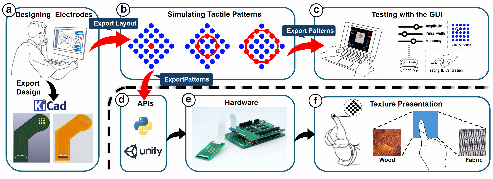

# eTactileKit: A Toolkit for Design Exploration and Rapid Prototyping of Electro-Tactile Interfaces

<p align="center">
  
</p>

## Abstract

Electro-tactile interfaces are becoming increasingly popular due to their unique advantages, such as delivering fast and localised tactile response, thin and flexible form factors, and the potential to create novel tactile experiences. However, insights from a formative study with typical designers highlighted the lack of resources, limited access to information and complexity of software and hardware tools. This establishes a high barrier to entry and limits the ability to rapidly prototype and experiment with electro-tactile interfaces. To address these challenges, we propose eTactileKit, a scalable and accessible toolkit providing end-to-end support for designing and prototyping electro-tactile interfaces. eTactileKit comprises a hardware platform and a software framework for designing, simulating and exploring electro-tactile stimuli. We evaluated the impact and usability of eTactileKit through a three-week long take-home study, which demonstrated increased accessibility, ease of use, and the toolkit's positive impact on design workflow. Additionally, we implemented a set of use cases to demonstrate the toolkit's practicality and effectiveness across various applications.

More information about the toolkit can be found in our [paper](https://doi.org/10.1145/3746059.3747796). If you use this work, please cite our paper:

```bibtex
@inproceedings{eTactileKit,
Will be added upon available in ACM DL
}
```

## Contributors

**[Praneeth Perera](https://www.github.com/PraneethPerera99), [Ravindu Madhushan](https://www.github.com/RavinduMPK), [Hiroyuki Kajimoto](https://kaji-lab.jp/en/index.php?people/kaji), [Arata Jingu](https://hci.cs.uni-saarland.de/people/arata-jingu/), [Jürgen Steimle](https://hci.cs.uni-saarland.de/people/juergen-steimle/), [Anusha Withana](https://www.github.com/wdanusha)**

## Documentation

To use our toolkit, you can find the complete documentation [here](8_Documentation/DOCUMENTATION.md). This guide is here to help you navigate and make the most of eTactileKit.

## License

Shield: [![CC BY-SA 4.0][cc-by-sa-shield]][cc-by-sa]

This work is licensed under a
[Creative Commons Attribution-ShareAlike 4.0 International License][cc-by-sa].

[![CC BY-SA 4.0][cc-by-sa-image]][cc-by-sa]

[cc-by-sa]: http://creativecommons.org/licenses/by-sa/4.0/
[cc-by-sa-image]: https://licensebuttons.net/l/by-sa/4.0/88x31.png
[cc-by-sa-shield]: https://img.shields.io/badge/License-CC%20BY--SA%204.0-lightgrey.svg

## Contact
If you have any issues with eTactileKit, please contact [PraneethPerera99](https://www.github.com/Praneeth Perera)
